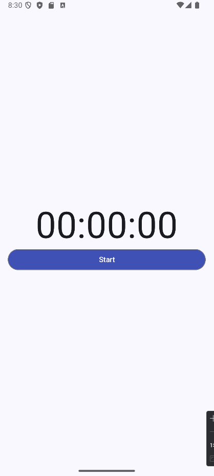

# Stopwatch App
A simple Stopwatch app made using Jetpack Compose

## Stopwatch States

The Stopwatch app has the following states:

1. **Initial State**: The stopwatch is not running, and the time is set to zero.
2. **Running State**: The stopwatch is actively counting time.
3. **Paused State**: The stopwatch has been stopped but not reset, so it retains the elapsed time.
4. **Resumed State**: The stopwatch continues counting from where it was paused.
5. **Reset State**: The stopwatch is stopped, and the time is reset to zero.

    
    
    

